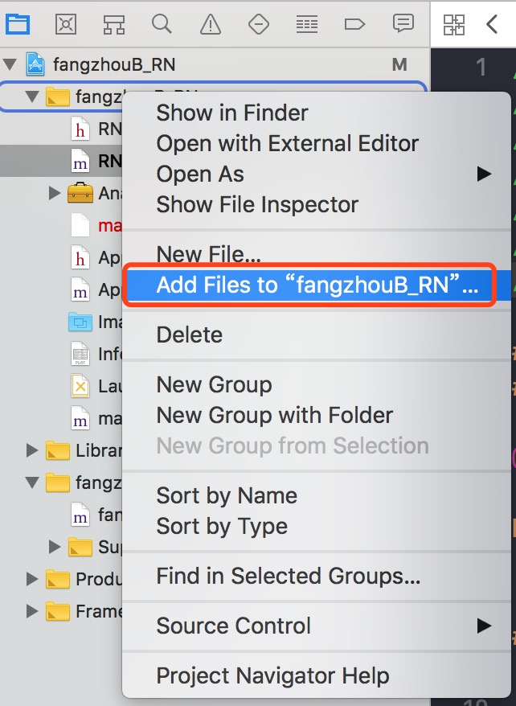
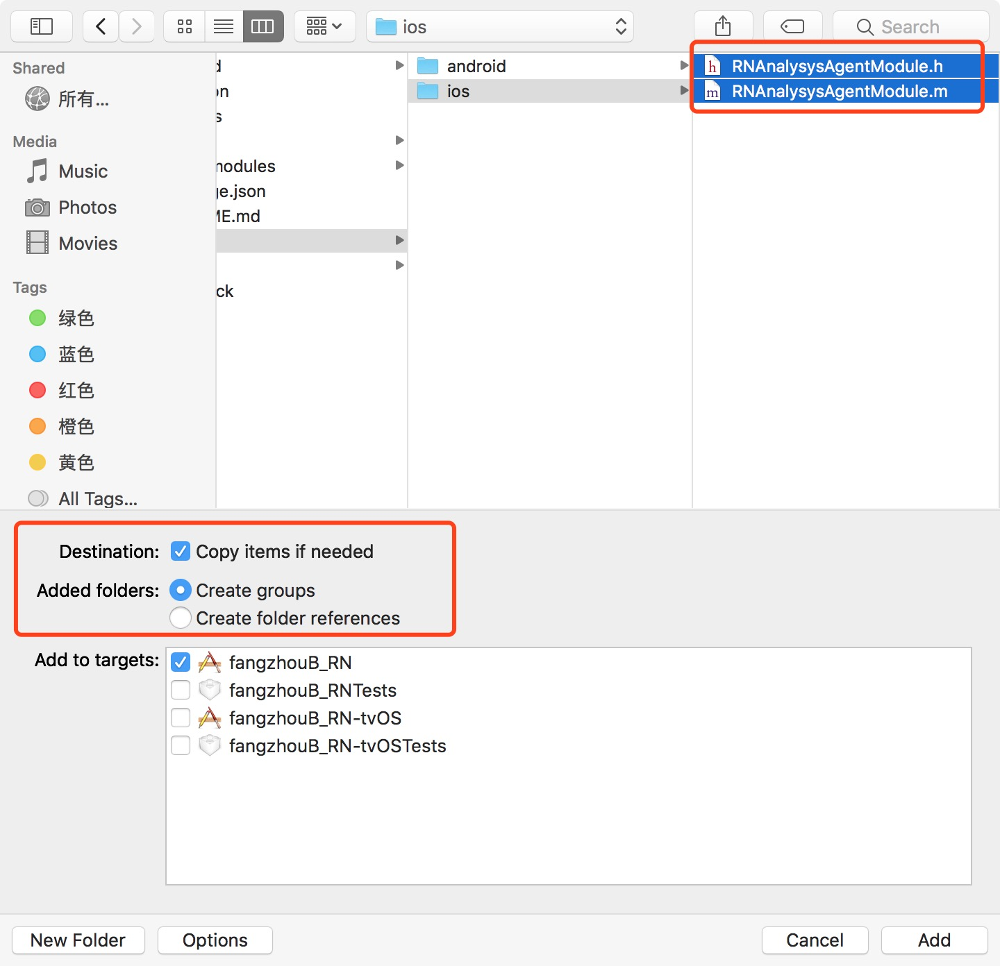
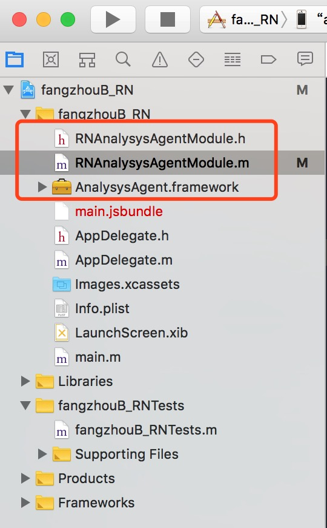
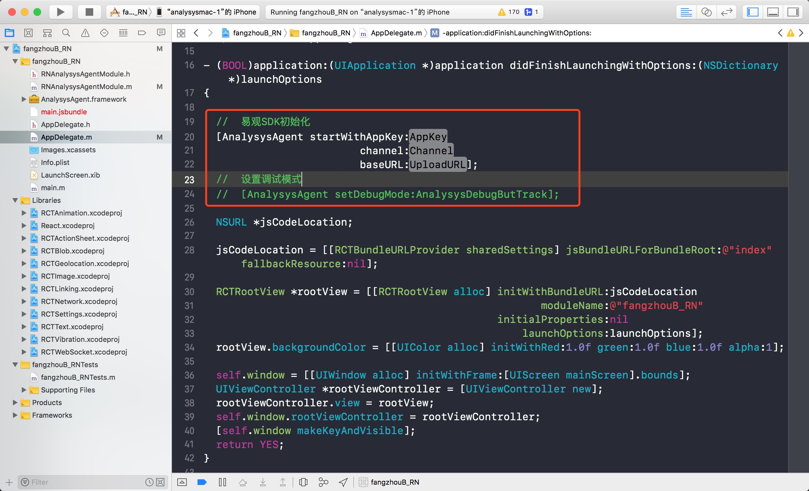
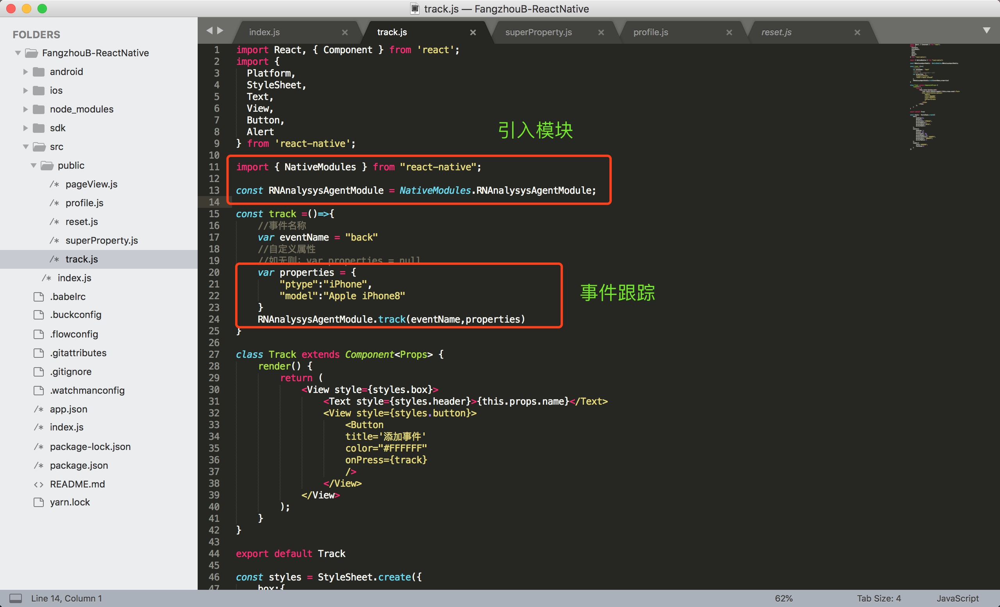
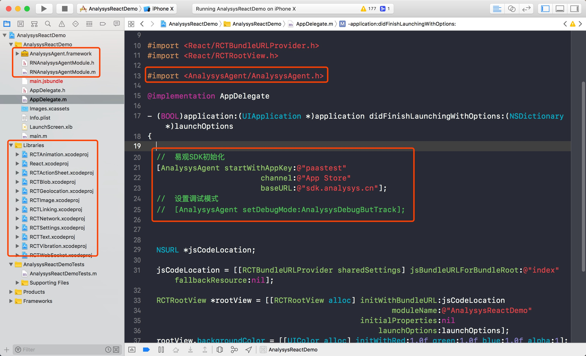

# React Native iOS SDK 使用说明

## 1. 集成准备

### 1.1 搭建`React Native`环境
参照`React Native` 官方文档 [搭建开发环境](https://reactnative.cn/docs/getting-started/)

### 1.2 易观SDK配置<span id = "SDKSetting">
参照 [iOS SDK 使用说明](https://ark.analysys.cn/docs/v2/manual/sdk_ios.html)，完成第一部分《集成准备》及第二部分《SDK初始化》工作。

## 2. Xcode 中配置

### 2.1 模块导入<span id = "moduleImport">
将`RNAnalysysAgentModule.h`和`RNAnalysysAgentModule.m`文件导入工程中。

* 右键添加文件

    

* Copy文件到工程

    

* 工程目录

    

### 2.2 SDK初始化及module注册<span id = "moduleRegist">

由于module注册已在`RNAnalysysAgentModule.m`文件中完成，因此只需进行SDK初始化即可。

* Objective-C 代码示例

在Xcode工程文件`~AppDelegate.m` 中导入头文件`"#import <AnalysysAgent/AnalysysAgent.h>"`，配置 SDK 相关内容。

如下图所示：



示例如下：

```objectivec
- (BOOL)application:(UIApplication *)application didFinishLaunchingWithOptions:(NSDictionary *)launchOptions
{
  
  //  易观SDK初始化
  [AnalysysAgent startWithAppKey:<#AppKey#>
                         channel:<#Channel#>
                         baseURL:<#UploadURL#>];
  //  设置调试模式
  //  [AnalysysAgent setDebugMode:AnalysysDebugButTrack];
  
  NSURL *jsCodeLocation;

  jsCodeLocation = [[RCTBundleURLProvider sharedSettings] jsBundleURLForBundleRoot:@"index" fallbackResource:nil];

  RCTRootView *rootView = [[RCTRootView alloc] initWithBundleURL:jsCodeLocation
                                                      moduleName:@"fangzhouB_RN"
                                               initialProperties:nil
                                                   launchOptions:launchOptions];
  rootView.backgroundColor = [[UIColor alloc] initWithRed:1.0f green:1.0f blue:1.0f alpha:1];

  self.window = [[UIWindow alloc] initWithFrame:[UIScreen mainScreen].bounds];
  UIViewController *rootViewController = [UIViewController new];
  rootViewController.view = rootView;
  self.window.rootViewController = rootViewController;
  [self.window makeKeyAndVisible];
  return YES;
}
```

<!--* Swift 代码示例

1. 建立桥接文件，并引入相应类库，如图所示：
    

2. 在Xcode工程文件`~AppDelegate.m` 中配置 SDK 相关内容。
如下图所示： 
    

示例如下：-->

## 3. React Native 中 JS 使用

### 3.1 js 获取 Analysys 模块
在 js 中获取 `RNAnalysysAgentModule` 模块

```js
//  易观统计模块
import { NativeModules } from "react-native";

const RNAnalysysAgentModule = NativeModules.RNAnalysysAgentModule;
```

### 3.2 接口调用

#### 3.2.1 接口调用方法

在相关需要进行统计的部分进行埋点。以点击购买事件为例：

```js
//  事件名称为：buy(购买)  事件附加属性为：ptype(产品分类): iPhone; model(型号): iPhone X
var properties = {
    'ptype': 'iPhone',
    'model': 'Apple iPhoneX'
}
RNAnalysysAgentModule.track('buy',properties)
```

如下图所示：



#### 3.2.2 其他接口调用

其他接口调用参考“iOS SDK 使用说明”或参考`RNAnalysysAgentModule.m`文件中 React-Native 示例说明。

## 4. 运行 Demo 工程

### 4.1 搭建 React Native 开发环境

根据React Native官方文档 《搭建开发环境》 中 [安装依赖](https://reactnative.cn/docs/getting-started/#%E5%AE%89%E8%A3%85%E4%BE%9D%E8%B5%96)

### 4.2 Demo 运行
<!--
1. 创建工程
$ react-native init AnalysysReactDemo

2. 删除工程中 node_modules 文件夹
3. 删除工程目录下 App.js，覆盖 index.js ，拷贝 src/ 目录到工程 AnalysysReactDemo 下
4. 修改覆盖后 index.js，中组件名称：`AppRegistry.registerComponent('AnalysysReactDemo', () => App);`
-->
1. 打开下载安装包
2. 进入 AnalysysReactDemo 目录下，执行命令：

    ```shell
    $ npm install  //  添加依赖
    ```
3. Demo调用示例
> 文件位置：AnalysysReactDemo/src/public：
> 在 pageView.js、profile.js、reset.js、superProperty.js、track.js 几个文件中查看相应的Demo调用示例
4. 运行程序

    * 完成 [1.2 易观SDK配置](#SDKSetting)
    <!--* 将 SDK 文件夹下 `RNAnalysysAgentModule.h` 和 `RNAnalysysAgentModule.m` 导入工程参照[2.1 模块导入](#moduleImport)-->
    * 完成 [2.2 SDK初始化及module注册](#moduleRegist)
    * 打开 `AnalysysReactDemo/ios` 工程，配置证书后便可真机运行
    * 运行Xcode，点击Demo按钮，在console中查看日志信息
5. 工程结构




